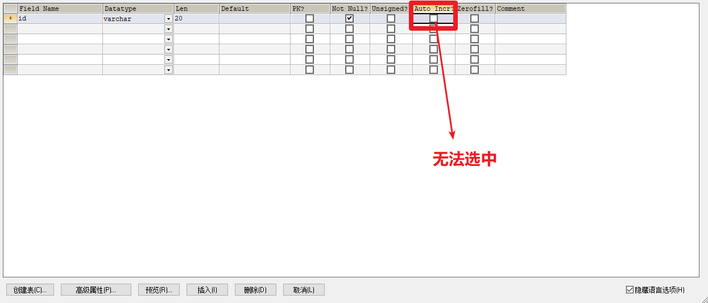

# 错误记录

## 1、使用 jdbc 出现错误

```
 java.sql.SQLException: The server time zone value 'Öйú±ê׼ʱ¼ä' is unrecognized or represents more than one time zone. You must configure either the server or JDBC driver (via the serverTimezone configuration property) to use a more specifc time zone value if you want to utilize time zone support.
```

### 解决

参考：

https://www.cnblogs.com/matd/articles/10500425.html

1. 在mysql中执行命令

   ```sql
   set global time_zone='+8:00' 
   ```

2. 在数据库驱动的url后加上 `serverTimezone=UTC`  参数

   

## 2、MySQL 数据库建表时，无法设置主键自增

### 2.1	问题描述



### 2.2	解决

1. 只能在数据类型为 integer 或 bigint 的列上创建 自增 属性。
2. 一个表只能有一个 自增列。
3. PK同Auto Incr有没有打钩

## 3、webSocket 问题

### 3.1	问题描述

```
25-Apr-2020 15:40:27.585 SEVERE [http-apr-8080-exec-7] org.apache.tomcat.websocket.pojo.PojoEndpointBase.onError No error handling configured for [aoing.service.WebSocketDemo] and the following error occurred
 java.io.EOFException: The client aborted the connection.
```

## 4、[Jackson 的 基本用法](https://www.cnblogs.com/guanbin-529/p/11488869.html)

